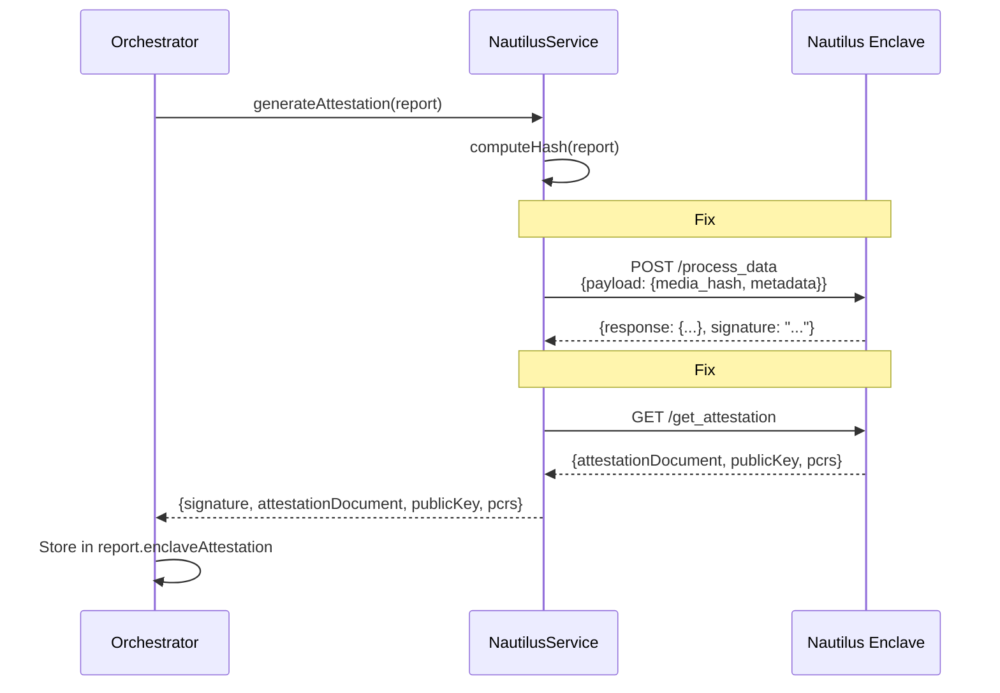

# Flow Audit Report - Media Provably Authentic

**Date**: November 23, 2025  
**Status**: ⚠️ ISSUES FOUND

---

## 🔍 Executive Summary

Rà soát toàn bộ luồng từ upload → AI detection → Nautilus signing → blockchain → frontend display.

**Critical Issues Found**: 1  
**Warnings**: 2  
**Recommendations**: 3

---

## ❌ CRITICAL ISSUE #1: Nautilus Payload Format Mismatch

### Problem:
Backend đang gửi **SAI FORMAT** cho Nautilus enclave `/process_data` endpoint.

### Current Code (WRONG):
```typescript
// backend/src/services/nautilus.ts:122-127
const response = await axios.post(
  `${this.apiUrl}/process_data`,
  {
    data: dataHash,           // ❌ WRONG: enclave expects "payload.media_hash"
    timestamp: Date.now(),    // ❌ WRONG: enclave expects inside "payload"
  }
);
```

### What Enclave Expects (from terminal output):
```json
{
  "payload": {
    "media_hash": "abc123def456789012345678901234567890123456789012345678901234",
    "metadata": "optional metadata string"
  }
}
```

### What Enclave Returns:
```json
{
  "response": {
    "intent": 0,
    "timestamp_ms": 1763914945540,
    "data": {
      "media_hash": "...",
      "verified": true,
      "timestamp_ms": 1763914945540,
      "metadata": "..."
    }
  },
  "signature": "3deb3ac27ab69c13d494d98d6c21b4c8156d017d947cdf177faff4fe3140706071c39f76a65cd1532ecd938185de088b3f2465666484214171a8e2354d71f307"
}
```

### Impact:
- ❌ Nautilus enclave calls are **FAILING**
- ❌ Falling back to **MOCK SIGNATURES**
- ❌ No real attestation documents
- ❌ No real PCR measurements
- ❌ Frontend shows mock data instead of real TEE proof

### Evidence:
```bash
# Test with correct format:
curl -X POST http://54.226.172.237:3000/process_data \
  -H "Content-Type: application/json" \
  -d '{"payload":{"media_hash":"abc123...","metadata":"test"}}' 
# ✅ SUCCESS: Returns signature + attestation

# Test with current backend format:
curl -X POST http://54.226.172.237:3000/process_data \
  -H "Content-Type: application/json" \
  -d '{"data":"abc123...","timestamp":1732391234000}' 
# ❌ FAIL: "missing field `payload`"
```

---

## ⚠️ WARNING #1: Attestation Document Not Being Fetched

### Problem:
Backend không bao giờ gọi `/get_attestation` endpoint để lấy attestation document.

### Current Flow:
1. ✅ Orchestrator calls `nautilus.generateAttestation(report)`
2. ✅ Nautilus calls `/process_data` (but with wrong format)
3. ❌ **NEVER** calls `/get_attestation` to get full attestation document

### Missing:
```typescript
// Should call this to get full attestation:
const attestation = await nautilus.getAttestation();
// Returns: { attestationDocument, publicKey, pcrs }
```

### Impact:
- Frontend will show empty attestation details
- No PCR measurements displayed
- No public key verification possible

---

## ⚠️ WARNING #2: Response Structure Mismatch

### Problem:
Backend expects `{ signature, attestation_document, public_key }` but enclave returns different structure.

### Current Code:
```typescript
// backend/src/services/nautilus.ts:136
const { signature, attestation_document, public_key } = response.data;
```

### Actual Enclave Response:
```json
{
  "response": { ... },
  "signature": "..."
}
```

### Impact:
- `attestation_document` will be `undefined`
- `public_key` will be `undefined`
- Only signature is captured (from wrong location)

---

## 📋 COMPLETE FLOW ANALYSIS

### ✅ Working Components:

1. **Upload Flow** ✅
   - Frontend → Backend `/api/upload`
   - Wallet signing
   - Encryption with Seal KMS
   - Storage to Walrus
   - Job queue submission

2. **AI Detection** ✅
   - Backend → AI Service (port 8000)
   - 7 models ensemble
   - Forensic analysis
   - Frequency analysis
   - Quality metrics
   - Returns correct format

3. **Reverse Search** ✅
   - Conditional logic (< 0.5 or > 0.8)
   - Google Lens API via SerpAPI
   - Image upload to catbox.moe
   - Returns matches with confidence

4. **3-Enclave Consensus** ✅
   - MultiWorkerProcessor spawns 3 parallel jobs
   - Each enclave processes independently
   - Aggregator collects reports
   - Weighted voting by reputation + stake
   - Consensus computed correctly

5. **Blockchain Submission** ✅
   - Aggregator stores report to Walrus
   - Submits attestation to Sui
   - Returns txHash and reportCID

6. **Frontend Display** ✅
   - Real-time socket updates
   - Process tree visualization
   - Metrics display
   - TEE attestation section (ready for data)

### ❌ Broken Components:

1. **Nautilus Integration** ❌
   - Wrong payload format
   - Missing attestation document fetch
   - Response parsing incorrect
   - **Result**: Using mock signatures instead of real

---

## 🔧 REQUIRED FIXES

### Fix #1: Correct Nautilus Payload Format

**File**: `backend/src/services/nautilus.ts`

**Change**:
```typescript
// BEFORE (lines 122-127):
const response = await axios.post(
  `${this.apiUrl}/process_data`,
  {
    data: dataHash,
    timestamp: Date.now(),
  }
);

// AFTER:
const response = await axios.post(
  `${this.apiUrl}/process_data`,
  {
    payload: {
      media_hash: dataHash,
      metadata: `Verification report for ${this.enclaveId}`,
    }
  }
);
```

### Fix #2: Parse Enclave Response Correctly

**File**: `backend/src/services/nautilus.ts`

**Change**:
```typescript
// BEFORE (line 136):
const { signature, attestation_document, public_key } = response.data;

// AFTER:
const { response: enclaveResponse, signature } = response.data;
// enclaveResponse contains: { intent, timestamp_ms, data }
```

### Fix #3: Fetch Full Attestation Document

**File**: `backend/src/services/nautilus.ts`

**Add after successful signing**:
```typescript
// After getting signature, fetch full attestation:
let attestationDocument: string | undefined;
let publicKey: string | undefined;
let pcrs: Record<string, string> | undefined;

try {
  const attestation = await this.getAttestation();
  attestationDocument = attestation.attestationDocument;
  publicKey = attestation.publicKey;
  pcrs = attestation.pcrs;
} catch (error) {
  console.warn('[Nautilus] Could not fetch attestation document:', error.message);
}

return {
  signature,
  attestationDocument,
  publicKey,
  pcrs,
};
```

### Fix #4: Update Return Type

**File**: `backend/src/services/nautilus.ts`

**Change**:
```typescript
// BEFORE:
async generateAttestation(reportData: any): Promise<{
  signature: string;
  attestationDocument?: string;
  publicKey?: string;
}> { ... }

// AFTER:
async generateAttestation(reportData: any): Promise<{
  signature: string;
  attestationDocument?: string;
  publicKey?: string;
  pcrs?: Record<string, string>;
}> { ... }
```

### Fix #5: Update Shared Types

**File**: `shared/src/types.ts`

Already has `pcrs` field - ✅ No change needed.

---

## 📊 TESTING CHECKLIST

After fixes, test:

- [ ] Upload image via frontend
- [ ] Check backend logs for `[Nautilus] Requesting enclave to sign report...`
- [ ] Verify NO fallback to mock: `⚠️  Falling back to mock attestation`
- [ ] Check logs for `[Nautilus] ✓ Report signed by enclave`
- [ ] Verify frontend displays:
  - [ ] Real signature (64+ chars hex)
  - [ ] Attestation document (base64 string)
  - [ ] Public key (64 chars hex)
  - [ ] PCR0 measurement (64 chars hex)
- [ ] Verify blockchain attestation includes real signature

---

## 🎯 RECOMMENDATIONS

### Recommendation #1: Add Request/Response Logging

Add detailed logging to debug Nautilus calls:

```typescript
console.log('[Nautilus] Request payload:', JSON.stringify(payload, null, 2));
console.log('[Nautilus] Response:', JSON.stringify(response.data, null, 2));
```

### Recommendation #2: Add Attestation Verification

After getting attestation, verify it's valid:

```typescript
const isValid = await this.verifyAttestation(signature, reportData);
if (!isValid) {
  throw new Error('Attestation verification failed');
}
```

### Recommendation #3: Cache Attestation Document

Attestation document doesn't change frequently, can cache it:

```typescript
private cachedAttestation?: {
  document: string;
  publicKey: string;
  pcrs: Record<string, string>;
  fetchedAt: number;
};

// Cache for 5 minutes
if (!this.cachedAttestation || Date.now() - this.cachedAttestation.fetchedAt > 300000) {
  this.cachedAttestation = {
    ...await this.getAttestation(),
    fetchedAt: Date.now(),
  };
}
```

---

## 📝 SEQUENCE DIAGRAM (CORRECTED)



---

## 🚨 PRIORITY

**CRITICAL** - Must fix before demo/production:
- Fix #1: Correct payload format
- Fix #2: Parse response correctly
- Fix #3: Fetch attestation document

**HIGH** - Should fix soon:
- Recommendation #1: Add logging
- Recommendation #2: Add verification

**MEDIUM** - Nice to have:
- Recommendation #3: Cache attestation

---

## ✅ AFTER FIXES

Expected logs:
```
[Nautilus] ✅ Connected to Nitro Enclave: http://54.226.172.237:3000
[Nautilus] Enclave ID: enclave_1
[Nautilus] Requesting enclave to sign report...
[Nautilus] ✓ Report signed by enclave enclave_1
[Nautilus] Fetching attestation document...
[Nautilus] ✓ Attestation document received
[Orchestrator] ✓ Report signed by Nautilus enclave enclave_1
```

Expected frontend display:
```
🔒 TEE Attestation Proof
Enclave ID: enclave_1
Public Key: 3738d1f87ff56f50d4d55a98e7a714b3aaabbd9c1353224d8ec2a4ae4f16373c
PCR0: b76f97be7ed01786c315a6b8c3957389ee796042dc0fdc3065d1f03800f5918d...
```

---

## 📚 REFERENCES

- Nautilus Enclave API: http://54.226.172.237:3000/
- Terminal output: Lines 963-1023 (Nautilus deployment)
- Backend code: `backend/src/services/nautilus.ts`
- Orchestrator: `backend/src/services/orchestrator.ts`
- Frontend: `frontend/components/VerificationResults.tsx`

---

**End of Audit Report**

