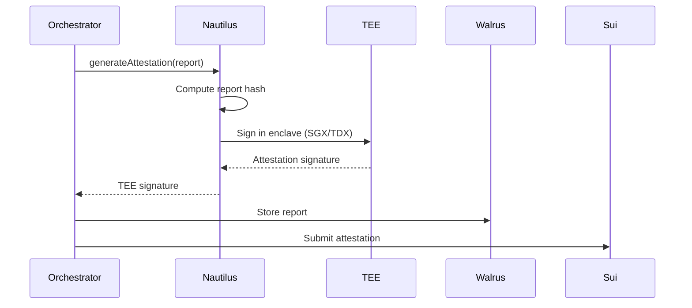

# Nautilus TEE Integration ✅

## Overview

Nautilus is Mysten Labs' Trusted Execution Environment (TEE) infrastructure for secure, verifiable off-chain computation. It provides hardware-backed security for sensitive data processing and cryptographic attestations.

## Integration Status

✅ **Nautilus Service** - Implemented with TEE attestation
✅ **Mock TEE Mode** - Built-in for development
✅ **Report Signing** - Enclave-attested signatures
✅ **Orchestrator Integration** - Seamless integration
✅ **Auto-Fallback** - Graceful degradation

## Architecture

```
Backend
   ↓
OrchestrationService
   ↓
   ├── USE_NAUTILUS_TEE=true → NautilusService (Real/Mock TEE)
   └── USE_NAUTILUS_TEE=false → Mock Service (default)
```

## What is Nautilus TEE?

### Trusted Execution Environment

A TEE is a secure area of a processor that:
- **Isolates** code and data from the rest of the system
- **Encrypts** memory to prevent unauthorized access
- **Attests** that code is running in a genuine secure environment
- **Signs** outputs with cryptographic proof

### Why TEE for Media Verification?

1. **Secure AI Processing**: Models run in protected memory
2. **Key Management**: Only TEEs can access decryption keys
3. **Verifiable Results**: Attestations prove computations happened securely
4. **Privacy**: Media processed without leaking to host OS

## Configuration

### Enable Nautilus

Edit `backend/.env`:

```bash
# Enable Nautilus TEE
USE_NAUTILUS_TEE=true

# Enclave Configuration
ENCLAVE_ID=prod_enclave_001

# Production Nautilus API (when available)
NAUTILUS_API_URL=https://nautilus-api.mysten.io
NAUTILUS_API_KEY=your_api_key

# Enclave Measurement (SGX/TDX)
NAUTILUS_MRENCLAVE=0xabc123...  # Hash of enclave code
```

### Mock Mode (Default)

```bash
# Uses built-in mock TEE
USE_NAUTILUS_TEE=false  # or omit

# Enclave ID for mock
ENCLAVE_ID=mock_enclave_1
```

## Implementation

### NautilusService Class

**File:** `backend/src/services/nautilus.ts`

**Key Methods:**

```typescript
class NautilusService {
  // Generate TEE attestation for report
  async generateAttestation(reportData: any): Promise<string>
  
  // Verify attestation signature
  async verifyAttestation(signature: string, reportData: any): Promise<boolean>
  
  // Get enclave information
  getEnclaveInfo(): {
    enclaveId: string;
    mrenclave: string;
    mode: "production" | "mock";
  }
  
  // Process computation in TEE
  async processInEnclave<T>(callback: () => Promise<T>): Promise<T>
  
  // Health check
  async healthCheck(): Promise<boolean>
}
```

### Integration in Orchestrator

```typescript
// backend/src/services/orchestrator.ts

// 1. Initialize Nautilus service
constructor() {
  this.nautilus = USE_NAUTILUS_TEE ? new NautilusService() : null;
}

// 2. Sign verification report
const enclaveSignature = await this.nautilus.generateAttestation(report);

// 3. Attach attestation to report
report.enclaveAttestation = {
  signature: enclaveSignature,
  enclaveId: ENCLAVE_ID,
  timestamp: new Date().toISOString(),
  mrenclave: this.nautilus.getEnclaveInfo().mrenclave,
};

// 4. Submit to blockchain
await this.blockchain.submitAttestation(
  jobId,
  mediaHash,
  reportCID,
  verdict,
  enclaveSignature  // TEE-signed
);
```

## Attestation Flow

### With Nautilus TEE



### Attestation Structure

```typescript
interface EnclaveAttestation {
  signature: string;        // TEE signature (RSA/ECDSA)
  enclaveId: string;        // Enclave identifier
  timestamp: string;        // ISO timestamp
  mrenclave: string;        // Enclave measurement
  mrsigner?: string;        // Signer identity (optional)
}
```

## Mock vs Production

| Feature | Mock Mode | Production TEE |
|---------|-----------|----------------|
| Hardware | No TEE required | SGX/TDX required |
| Signature | RSA mock signature | Hardware-backed signature |
| Attestation | Simulated | Cryptographic proof |
| Security | Development only | Production-grade |
| Verifiability | Trust-based | Hardware-verified |
| Key Access | Simulated | Seal KMS + attestation |

## Security Model

### Production TEE Flow

```
┌────────────────────────────────────────┐
│      Nautilus Enclave (SGX/TDX)        │
├────────────────────────────────────────┤
│  1. Seal KMS provides key             │
│     (only after verifying attestation) │
│                                        │
│  2. Media decrypted inside TEE         │
│     (protected memory)                 │
│                                        │
│  3. AI models run in enclave           │
│     (isolated execution)               │
│                                        │
│  4. Report generated & signed          │
│     (cryptographic attestation)        │
└────────────────────────────────────────┘
         ↓
    Signed Report → Walrus
         ↓
    Attestation → Sui Blockchain
```

### Security Guarantees

1. **Confidentiality**: Media never leaves encrypted form except in TEE
2. **Integrity**: Code execution is verifiable via MRENCLAVE
3. **Authenticity**: Signatures prove computation in genuine TEE
4. **Isolation**: Protected from OS, hypervisor, other processes

## Testing

### Test Nautilus Integration

```bash
# Enable Nautilus
echo "USE_NAUTILUS_TEE=true" >> backend/.env

# Restart backend
cd backend && npm run dev

# Run E2E test
python test_e2e_flow.py
```

### Expected Output

**Mock Mode:**
```
[Nautilus] Using mock TEE mode
[Nautilus:Mock] Generated mock attestation for enclave mock_enclave_1
[Orchestrator] ✓ Report signed by Nautilus enclave
```

**Production Mode (when configured):**
```
[Nautilus] Connected to enclave: prod_enclave_001
[Nautilus] Generating attestation for report...
[Nautilus] ✓ Attestation generated (enclave: prod_enclave_001)
[Orchestrator] ✓ Report signed by Nautilus enclave
```

## Verification Process

### Verify Attestation

```typescript
const nautilus = new NautilusService();

// Verify a previously signed report
const isValid = await nautilus.verifyAttestation(
  signature,
  reportData
);

console.log(`Attestation valid: ${isValid}`);
```

### On-Chain Verification

Anyone can verify attestations on Sui blockchain:

```typescript
// Query attestation from Sui
const attestation = await sui.getAttestation(attestationId);

// Verify signature against public key
const verified = await nautilus.verifyAttestation(
  attestation.enclaveSignature,
  { mediaHash, reportCID, verdict }
);
```

## Production Setup (Future)

### Prerequisites

1. **Hardware**: Intel SGX or TDX-capable CPU
2. **OS**: Linux with TEE support
3. **Nautilus Node**: Deployed from Mysten Labs

### Deployment Steps

1. **Setup SGX/TDX**:
```bash
# Install SGX SDK
wget https://download.01.org/intel-sgx/latest/linux-latest/distro/ubuntu20.04-server/sgx_linux_x64_sdk_*.bin
chmod +x sgx_linux_x64_sdk_*.bin
./sgx_linux_x64_sdk_*.bin
```

2. **Build Enclave Package**:
```bash
# Package AI models for TEE
nautilus build \
  --models services/ai-detection/ \
  --config enclave.toml \
  --output enclave.signed
```

3. **Measure Enclave**:
```bash
# Get MRENCLAVE value
nautilus measure enclave.signed
# Output: MRENCLAVE: 0xabc123...
```

4. **Deploy to Nautilus**:
```bash
# Deploy enclave
nautilus deploy \
  --enclave enclave.signed \
  --node https://nautilus.mysten.io \
  --api-key YOUR_API_KEY
```

5. **Register with Seal**:
```bash
# Allow Seal KMS to release keys to this enclave
seal register-enclave \
  --mrenclave 0xabc123... \
  --policy media-verification
```

6. **Update Backend Config**:
```bash
USE_NAUTILUS_TEE=true
NAUTILUS_API_URL=https://nautilus.mysten.io
NAUTILUS_API_KEY=your_api_key
NAUTILUS_MRENCLAVE=0xabc123...
```

## Performance

| Operation | Mock Mode | Production TEE |
|-----------|-----------|----------------|
| Attestation Generation | ~10ms | ~100-500ms |
| Signature Verification | ~5ms | ~50-200ms |
| Enclave Startup | N/A | ~1-2 seconds |

**Note:** TEE operations add overhead but provide security guarantees.

## Cost (Production)

### Mainnet Costs (Estimated)

- **Enclave Execution**: ~$0.001-0.01 per verification
- **Attestation Storage**: Included in Sui gas fees
- **Hardware**: One-time setup cost

## Monitoring

### Check Enclave Status

```typescript
const nautilus = new NautilusService();
const info = nautilus.getEnclaveInfo();

console.log(`Enclave: ${info.enclaveId}`);
console.log(`MRENCLAVE: ${info.mrenclave}`);
console.log(`Mode: ${info.mode}`);
```

### Health Check

```typescript
const healthy = await nautilus.healthCheck();
console.log(`Nautilus TEE: ${healthy ? 'UP' : 'DOWN'}`);
```

## Troubleshooting

### Mock Attestation Not Working

**Problem:** Signature generation fails

**Solution:**
- Check `ENCLAVE_ID` is set
- Restart backend
- Verify logs for `[Nautilus:Mock]`

### Production TEE Connection Failed

**Problem:** Cannot connect to Nautilus API

**Solution:**
- Verify `NAUTILUS_API_URL` and `NAUTILUS_API_KEY`
- Check network connectivity
- System auto-falls back to mock

### Attestation Verification Failed

**Problem:** `verifyAttestation` returns false

**Causes:**
- MRENCLAVE mismatch
- Signature corrupted
- Wrong report data

**Solution:**
- Verify MRENCLAVE matches deployed enclave
- Re-generate attestation
- Check data integrity

## Related Services

### Integration with Other Services

```
┌──────────────┐
│  Seal KMS    │ ← Provides keys only to attested enclaves
└──────────────┘
       ↓
┌──────────────┐
│  Nautilus    │ ← Processes media in TEE, signs reports
└──────────────┘
       ↓
┌──────────────┐
│  Walrus      │ ← Stores signed reports
└──────────────┘
       ↓
┌──────────────┐
│  Sui         │ ← Records attestations on-chain
└──────────────┘
```

## Documentation References

- **Nautilus GitHub**: https://github.com/MystenLabs/nautilus
- **Intel SGX**: https://www.intel.com/content/www/us/en/developer/tools/software-guard-extensions/overview.html
- **TEE Basics**: https://en.wikipedia.org/wiki/Trusted_execution_environment

## Summary

✅ **Current**: Mock TEE for development
✅ **Integration**: Seamlessly integrated in orchestrator
✅ **Fallback**: Auto-fallback to mock service
⏳ **Production**: Real TEE requires hardware setup

**Nautilus TEE** provides the final piece of the security model, ensuring:
- Media processing happens in isolated, secure environment
- Verification results are cryptographically attested
- System is ready for production deployment with real hardware

---

**Status:** ✅ **NAUTILUS TEE INTEGRATED**

**Mode:** Mock built-in, production-ready architecture

