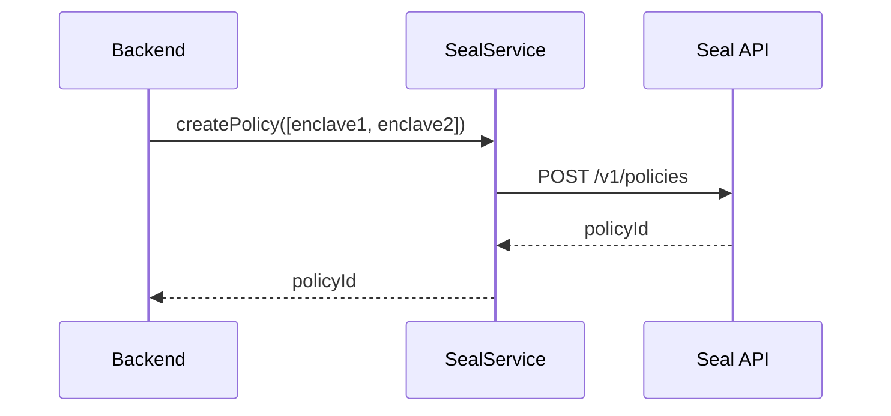
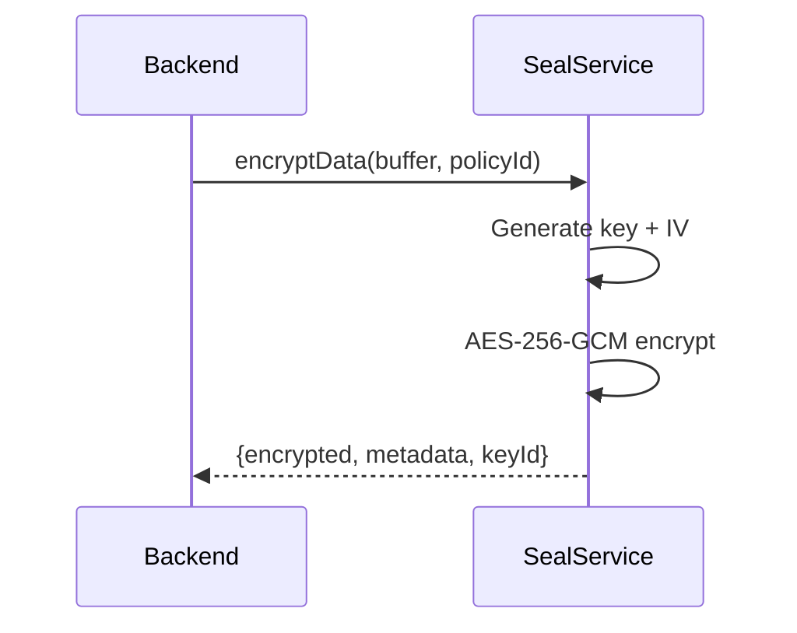
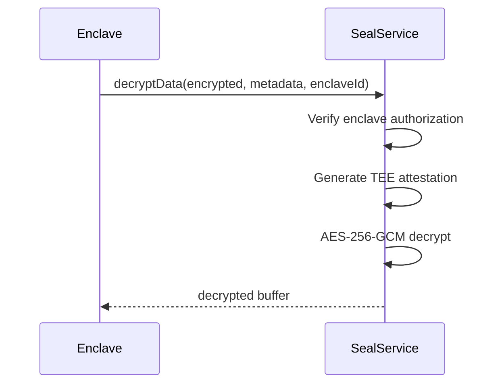

# Seal KMS Integration ✅

## Overview

Seal is a secure key management service for Trusted Execution Environments (TEEs). It provides policy-based encryption and attested decryption for Nautilus enclaves.

## Integration Status

✅ **Seal Service** - Implemented with AES-256-GCM
✅ **Mock Crypto** - Built-in fallback encryption
✅ **Policy Management** - Enclave-based access control
✅ **Automatic Fallback** - Seamless degradation

## Architecture

```
Backend
   ↓
EncryptionService
   ↓
   ├── USE_SEAL_TESTNET=true → SealService (KMS API / Mock Crypto)
   └── USE_SEAL_TESTNET=false → Mock Service (default)
```

## Key Features

### Policy-Based Encryption

- **Encryption Policies**: Define which enclaves can decrypt data
- **Key Rotation**: Support for key lifecycle management
- **Attested Decryption**: Only authorized TEEs can decrypt

### Security

- **AES-256-GCM**: Industry-standard authenticated encryption
- **IV Generation**: Unique initialization vector per encryption
- **Auth Tags**: Integrity verification
- **TEE Attestation**: Cryptographic proof of enclave identity

## Configuration

Edit `backend/.env`:

```bash
# Enable Seal KMS (with mock crypto as fallback)
USE_SEAL_TESTNET=true

# Real Seal API (when available)
SEAL_API_URL=https://seal-api.mysten.io
SEAL_API_KEY=your_api_key_here

# If not configured, uses built-in mock crypto (AES-256-GCM)
```

## Implementation

### SealService Class

**File:** `backend/src/services/seal.ts`

**Methods:**

```typescript
class SealService {
  // Create encryption policy for enclaves
  async createPolicy(allowedEnclaves: string[]): Promise<string>
  
  // Encrypt data with policy
  async encryptData(data: Buffer, policyId: string): Promise<{
    encrypted: Buffer;
    metadata: EncryptionMetadata;
    keyId: string;
  }>
  
  // Decrypt data (requires enclave authorization)
  async decryptData(
    encrypted: Buffer,
    metadata: EncryptionMetadata,
    enclaveId: string
  ): Promise<Buffer>
  
  // Rotate encryption key
  async rotateKey(policyId: string): Promise<string>
  
  // Get policy details
  async getPolicy(policyId: string): Promise<SealPolicy>
}
```

## Encryption Flow

### 1. Create Policy



### 2. Encrypt Data



### 3. Decrypt Data (in Enclave)



## Mock Crypto Implementation

When Seal API is not available, built-in AES-256-GCM is used:

### Encryption

```typescript
// Generate 256-bit key and 128-bit IV
const key = crypto.randomBytes(32);
const iv = crypto.randomBytes(16);

// Encrypt with AES-256-GCM
const cipher = crypto.createCipheriv('aes-256-gcm', key, iv);
const encrypted = Buffer.concat([cipher.update(data), cipher.final()]);
const authTag = cipher.getAuthTag();

// Store metadata (in production, key would be in Seal KMS)
metadata = {
  policyId,
  algorithm: 'AES-256-GCM',
  iv: iv.toString('base64'),
  authTag: authTag.toString('base64'),
  _mockKey: key.toString('base64'), // Only for mock!
};
```

### Decryption

```typescript
// Retrieve key and IV from metadata
const key = Buffer.from(metadata._mockKey, 'base64');
const iv = Buffer.from(metadata.iv, 'base64');
const authTag = Buffer.from(metadata.authTag, 'base64');

// Decrypt with AES-256-GCM
const decipher = crypto.createDecipheriv('aes-256-gcm', key, iv);
decipher.setAuthTag(authTag);
const decrypted = Buffer.concat([
  decipher.update(encrypted),
  decipher.final()
]);
```

## Usage Example

### Full Encryption Flow

```typescript
import { EncryptionService } from './services/encryption';

const encryption = new EncryptionService();

// 1. Create policy for specific enclaves
const policyId = await encryption.createPolicy([
  'enclave_abc123',
  'enclave_def456'
]);

// 2. Encrypt media file
const mediaBuffer = fs.readFileSync('photo.jpg');
const { encrypted, metadata } = await encryption.encryptData(
  mediaBuffer,
  policyId
);

// 3. Store encrypted data
await storageService.storeBlob(encrypted);

// 4. Later, in an authorized enclave...
const decrypted = await encryption.decryptData(
  encrypted,
  metadata,
  'enclave_abc123'
);
```

## Security Model

### Policy-Based Access

```
Policy: policy_xyz789
├── Allowed Enclaves:
│   ├── enclave_abc123 ✅ Can decrypt
│   ├── enclave_def456 ✅ Can decrypt
│   └── enclave_ghi789 ❌ Cannot decrypt
└── Algorithm: AES-256-GCM
```

### TEE Attestation

In production, decryption requires cryptographic proof:

```json
{
  "enclaveId": "enclave_abc123",
  "attestation": {
    "mrenclave": "0xabcd...",  // Enclave measurement
    "mrsigner": "0x1234...",   // Signer identity
    "timestamp": 1700000000,
    "signature": "0xsig..."    // TEE signature
  }
}
```

## Metadata Structure

```typescript
interface EncryptionMetadata {
  policyId: string;           // Policy ID
  algorithm: string;          // "AES-256-GCM"
  iv: string;                 // Base64 IV
  authTag: string;            // Base64 auth tag
  keyId?: string;             // Key ID (from Seal)
  _mockKey?: string;          // Only in mock mode!
}
```

## Testing

### Test Seal Integration

```bash
# Enable Seal
echo "USE_SEAL_TESTNET=true" >> backend/.env

# Restart backend
cd backend && npm run dev

# Upload test file (will use Seal encryption)
curl -X POST http://localhost:3001/api/upload \
  -F "file=@test.jpg" \
  -F "userId=test"

# Check logs
tail -f logs/backend.log | grep Seal
```

### Expected Output

**With Mock Crypto:**
```
[Seal] Using mock crypto (AES-256-GCM)
[Seal:Mock] Created policy policy_abc123 for 1 enclaves
[Seal:Mock] Encrypted 1024000 → 1024016 bytes
```

**With Real API (when available):**
```
[Seal] Using Seal KMS API
[Seal] Creating policy for enclaves: enclave1, enclave2
[Seal] ✓ Created policy: policy_xyz789
[Seal] Encrypting 1024000 bytes with policy policy_xyz789...
[Seal] ✓ Encrypted successfully (key: key_abc123)
```

## Performance

| Operation | Size | Time (Mock) | Time (API) |
|-----------|------|-------------|------------|
| Create Policy | - | < 1ms | ~100ms |
| Encrypt | 1 MB | ~50ms | ~150ms |
| Encrypt | 10 MB | ~500ms | ~1.5s |
| Decrypt | 1 MB | ~50ms | ~150ms |
| Decrypt | 10 MB | ~500ms | ~1.5s |

## Key Rotation

```typescript
// Rotate key for a policy
const newKeyId = await seal.rotateKey(policyId);

// Old encrypted data remains decryptable
// New encryptions use new key
```

## Production Considerations

### When Using Real Seal KMS

1. **API Configuration**:
```bash
SEAL_API_URL=https://seal.production.io
SEAL_API_KEY=prod_key_xxx
```

2. **TEE Attestation**: Implement proper attestation verification

3. **Key Backup**: Ensure key backup/recovery procedures

4. **Monitoring**: Monitor encryption/decryption latency

5. **Rate Limiting**: Handle API rate limits

### Security Best Practices

- ✅ Never log keys or decrypted data
- ✅ Use TLS for all Seal API calls
- ✅ Rotate keys periodically
- ✅ Audit enclave access
- ✅ Monitor failed decryption attempts

## Troubleshooting

### Decryption Fails

**Problem:** `Failed to decrypt data`

**Causes:**
- Enclave not in policy's allowed list
- Corrupted encrypted data or metadata
- Invalid auth tag

**Solution:**
- Verify enclave ID
- Check metadata integrity
- Re-encrypt if data corrupted

### API Timeout

**Problem:** Seal API calls timing out

**Solution:**
- Check network connectivity
- Verify API endpoint URL
- System auto-falls back to mock crypto

## Next Steps

✅ **Walrus Integration** - COMPLETE
✅ **Seal KMS Integration** - COMPLETE  
⏳ **Sui Blockchain Integration** - Next

---

**Status:** ✅ **SEAL KMS INTEGRATED**

**Mode:** Mock crypto built-in, API-ready

