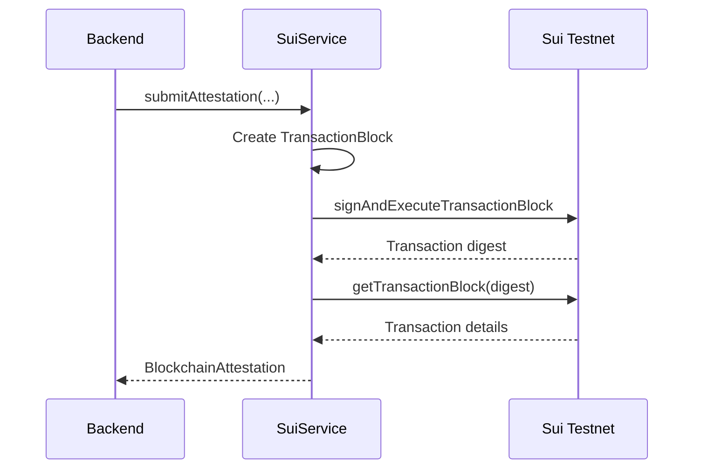
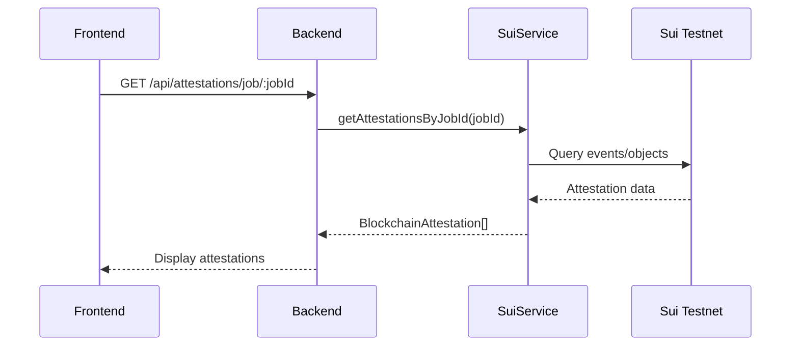

# Sui Blockchain Integration ✅

## Overview

Sui is a high-performance Layer 1 blockchain with an object-centric data model. It provides immutable storage for verification attestations with fast finality and low transaction costs.

## Integration Status

✅ **Sui Service** - Testnet integration with @mysten/sui SDK
✅ **Smart Contract Ready** - Move contract interface defined
✅ **Transaction Handling** - Sign and execute transactions
✅ **Mock Fallback** - Built-in mock mode
✅ **Network Support** - Testnet, Devnet, Mainnet

## Architecture

```
Backend
   ↓
BlockchainService
   ↓
   ├── USE_SUI_TESTNET=true → SuiService (Real blockchain)
   └── USE_SUI_TESTNET=false → Mock Service (default)
```

## Configuration

### Enable Sui Testnet

Edit `backend/.env`:

```bash
# Enable Sui blockchain
USE_SUI_TESTNET=true

# Network selection
SUI_NETWORK=testnet  # or devnet, mainnet

# Private key (Ed25519, hex format)
SUI_PRIVATE_KEY=your_private_key_hex

# Smart contract package ID (after deployment)
SUI_PACKAGE_ID=0xabcd1234...
```

### Setup Sui Wallet

```bash
# Install Sui CLI
cargo install --locked --git https://github.com/MystenLabs/sui.git --branch testnet sui

# Connect to testnet
sui client new-env --alias testnet --rpc https://fullnode.testnet.sui.io:443

# Create new address
sui client new-address ed25519

# Get testnet SUI tokens
curl --location --request POST 'https://faucet.testnet.sui.io/gas' \
  --header 'Content-Type: application/json' \
  --data-raw '{"FixedAmountRequest":{"recipient":"YOUR_ADDRESS"}}'

# Export private key
sui keytool export --key-identity YOUR_ADDRESS
```

## Implementation

### SuiService Class

**File:** `backend/src/services/sui.ts`

**Key Methods:**

```typescript
class SuiService {
  // Submit attestation to blockchain
  async submitAttestation(
    jobId: string,
    mediaHash: string,
    reportCID: string,
    verdict: Verdict,
    enclaveSignature: string
  ): Promise<BlockchainAttestation>
  
  // Query attestation by ID
  async getAttestation(attestationId: string): Promise<BlockchainAttestation | null>
  
  // Query attestations for a job
  async getAttestationsByJobId(jobId: string): Promise<BlockchainAttestation[]>
  
  // Get wallet address
  getAddress(): string | null
  
  // Get SUI balance
  async getBalance(): Promise<string>
  
  // Check network health
  async healthCheck(): Promise<boolean>
}
```

## Attestation Flow

### Submit Attestation to Sui



### Query Attestation



## Smart Contract (Move)

### Contract Structure

The Sui smart contract needs to be deployed. Example Move module:

```move
module media_verification::attestation {
    use sui::object::{Self, UID};
    use sui::tx_context::TxContext;
    use sui::transfer;
    use std::string::String;

    /// Attestation object stored on-chain
    struct Attestation has key, store {
        id: UID,
        job_id: String,
        media_hash: String,
        report_cid: String,
        verdict: String,
        enclave_signature: String,
        timestamp: u64,
        submitter: address,
    }

    /// Submit a new attestation
    public entry fun submit_attestation(
        job_id: String,
        media_hash: String,
        report_cid: String,
        verdict: String,
        enclave_signature: String,
        timestamp: u64,
        ctx: &mut TxContext
    ) {
        let attestation = Attestation {
            id: object::new(ctx),
            job_id,
            media_hash,
            report_cid,
            verdict,
            enclave_signature,
            timestamp,
            submitter: tx_context::sender(ctx),
        };
        
        // Share object so anyone can read it
        transfer::share_object(attestation);
    }
    
    /// Query attestations (via events or indexer)
    // Implementation depends on your query needs
}
```

### Deploy Contract

```bash
# Build contract
cd contracts
sui move build

# Deploy to testnet
sui client publish --gas-budget 100000000

# Copy the package ID
# Update .env with SUI_PACKAGE_ID
```

## Transaction Structure

### Creating a Transaction

```typescript
const tx = new TransactionBlock();

tx.moveCall({
  target: `${PACKAGE_ID}::media_verification::submit_attestation`,
  arguments: [
    tx.pure(jobId),           // String
    tx.pure(mediaHash),       // String
    tx.pure(reportCID),       // String
    tx.pure(verdict),         // String
    tx.pure(enclaveSignature), // String
    tx.pure(Date.now()),      // u64
  ],
});

const result = await client.signAndExecuteTransactionBlock({
  signer: keypair,
  transactionBlock: tx,
});
```

## BlockchainAttestation Type

```typescript
interface BlockchainAttestation {
  attestationId: string;      // UUID
  jobId: string;              // Verification job ID
  mediaHash: string;          // SHA-256 of media
  reportCID: string;          // Walrus blob ID
  verdict: Verdict;           // REAL | AI_GENERATED | MANIPULATED
  enclaveSignature: string;   // TEE signature
  txHash: string;             // Sui transaction digest
  blockNumber: number;        // Checkpoint number
  timestamp: string;          // ISO timestamp
  network: string;            // testnet | devnet | mainnet
}
```

## Testing

### Test Sui Integration

```bash
# 1. Setup Sui wallet and get testnet tokens
sui client faucet

# 2. Export private key
sui keytool export --key-identity YOUR_ADDRESS
# Copy the hex private key

# 3. Configure backend
cat >> backend/.env << EOF
USE_SUI_TESTNET=true
SUI_NETWORK=testnet
SUI_PRIVATE_KEY=YOUR_PRIVATE_KEY_HEX
SUI_PACKAGE_ID=YOUR_PACKAGE_ID
EOF

# 4. Restart backend
cd backend && npm run dev

# 5. Upload test file
curl -X POST http://localhost:3001/api/upload \
  -F "file=@test.jpg" \
  -F "userId=test"

# 6. Check Sui transaction
# Look for transaction digest in logs
sui client tx-block {DIGEST}
```

### Expected Output

**With Mock Mode:**
```
[Sui] No private key, using mock mode
[Sui:Mock] Created attestation abc-123-def
```

**With Sui Testnet:**
```
[Sui] Connected to testnet
[Sui] Submitting attestation for job job_xxx...
[Sui] ✓ Attestation submitted (tx: 0xabcd1234...)
```

### Verify on Sui Explorer

Visit: https://suiexplorer.com/?network=testnet

Search for your transaction digest to see the attestation on-chain.

## Network Endpoints

| Network | RPC Endpoint | Explorer |
|---------|-------------|----------|
| Testnet | `https://fullnode.testnet.sui.io:443` | https://suiexplorer.com/?network=testnet |
| Devnet | `https://fullnode.devnet.sui.io:443` | https://suiexplorer.com/?network=devnet |
| Mainnet | `https://fullnode.mainnet.sui.io:443` | https://suiexplorer.com |

## Faucet

Get testnet SUI tokens:

```bash
# Via CLI
sui client faucet

# Via API
curl --location --request POST 'https://faucet.testnet.sui.io/gas' \
  --header 'Content-Type: application/json' \
  --data-raw '{"FixedAmountRequest":{"recipient":"YOUR_ADDRESS"}}'
```

## Performance

| Operation | Time | Cost (Testnet) |
|-----------|------|----------------|
| Submit Attestation | ~2-5 seconds | Free (faucet) |
| Query Attestation | ~100-500ms | Free (read) |
| Transaction Finality | ~2 seconds | N/A |

**Mainnet Costs (Estimated):**
- Submit Attestation: ~0.0001 SUI (~$0.001)
- Read operations: Free

## Monitoring

### Check Wallet Balance

```typescript
const sui = new SuiService();
const balance = await sui.getBalance();
console.log(`Balance: ${balance} MIST`); // 1 SUI = 1e9 MIST
```

### Check Network Health

```typescript
const healthy = await sui.healthCheck();
console.log(`Sui ${SUI_NETWORK}: ${healthy ? 'UP' : 'DOWN'}`);
```

### View Transactions

```bash
# Get recent transactions for your address
sui client objects

# View specific transaction
sui client tx-block {DIGEST}
```

## Error Handling

### Insufficient Gas

**Problem:** Transaction fails with "Insufficient gas"

**Solution:**
```bash
# Get more testnet SUI
sui client faucet

# Check balance
sui client gas
```

### Invalid Private Key

**Problem:** "Invalid private key, using mock mode"

**Solution:**
- Ensure private key is in hex format
- Export from Sui wallet: `sui keytool export`
- Verify format: 64 hex characters

### Package Not Found

**Problem:** "Package not found"

**Solution:**
- Deploy smart contract first
- Update `SUI_PACKAGE_ID` in .env
- Verify package exists: `sui client object {PACKAGE_ID}`

## Security Considerations

### Private Key Management

- ✅ Store private key in `.env` (never commit!)
- ✅ Use environment variables in production
- ✅ Consider hardware wallet for mainnet
- ✅ Rotate keys periodically

### Transaction Security

- ✅ Verify transaction results
- ✅ Check gas costs before execution
- ✅ Use gas budget limits
- ✅ Monitor for failed transactions

### On-Chain Data

- ⚠️ Attestations are **public** once on-chain
- ⚠️ Media hash is visible (but media is encrypted)
- ⚠️ Report CID can be queried by anyone
- ✅ Sensitive data stays in encrypted Walrus storage

## Querying Attestations

### Via Sui Client

```typescript
// Query by object ID
const object = await client.getObject({
  id: attestationId,
  options: { showContent: true }
});

// Query by event
const events = await client.queryEvents({
  query: {
    MoveEventType: `${PACKAGE_ID}::media_verification::AttestationSubmitted`
  }
});
```

### Via GraphQL (Sui Indexer)

```graphql
query GetAttestations($jobId: String!) {
  objects(
    filter: {
      type: "0x...::attestation::Attestation"
      owner: null
    }
  ) {
    nodes {
      content {
        json
      }
    }
  }
}
```

## Mainnet Migration

When ready for production:

1. **Deploy to Mainnet:**
```bash
SUI_NETWORK=mainnet
sui client publish --gas-budget 100000000
```

2. **Update Configuration:**
```bash
SUI_NETWORK=mainnet
SUI_PACKAGE_ID=0xYOUR_MAINNET_PACKAGE
```

3. **Fund Wallet:**
- Buy SUI from exchange
- Transfer to your address
- Ensure sufficient balance for gas

4. **Monitor Costs:**
- Track gas usage
- Set up alerts for low balance
- Implement gas estimation

## Integration Summary

### All 3 Services Integrated

```
┌─────────────────────────────────────────────────┐
│              Media Upload Flow                   │
└─────────────────────────────────────────────────┘
                     ↓
         ┌───────────────────────┐
         │   1. SEAL KMS         │
         │   Encrypt media       │
         └───────────────────────┘
                     ↓
         ┌───────────────────────┐
         │   2. WALRUS           │
         │   Store encrypted     │
         └───────────────────────┘
                     ↓
         ┌───────────────────────┐
         │   Process + Verify    │
         └───────────────────────┘
                     ↓
         ┌───────────────────────┐
         │   3. SUI BLOCKCHAIN   │
         │   Immutable record    │
         └───────────────────────┘
```

## Next Steps

1. ✅ **Test Integration** - Upload and verify end-to-end
2. ⏳ **Deploy Smart Contract** - Publish Move module
3. ⏳ **Optimize Gas Usage** - Batch transactions if needed
4. ⏳ **Implement Indexer** - For efficient queries
5. ⏳ **Mainnet Migration** - When ready for production

---

**Status:** ✅ **SUI BLOCKCHAIN INTEGRATED**

**Mode:** SDK integrated, smart contract deployment pending

