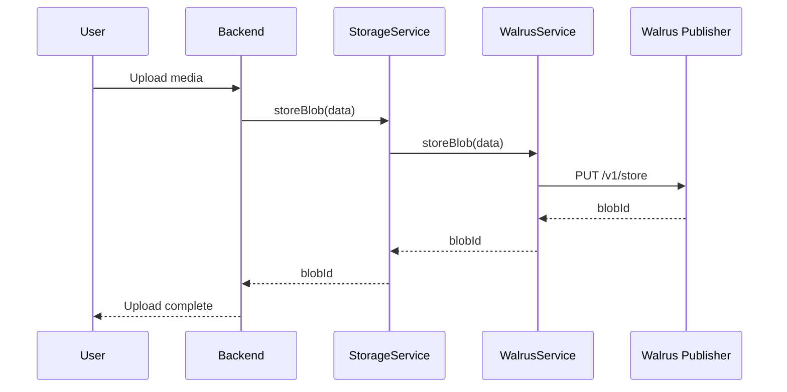
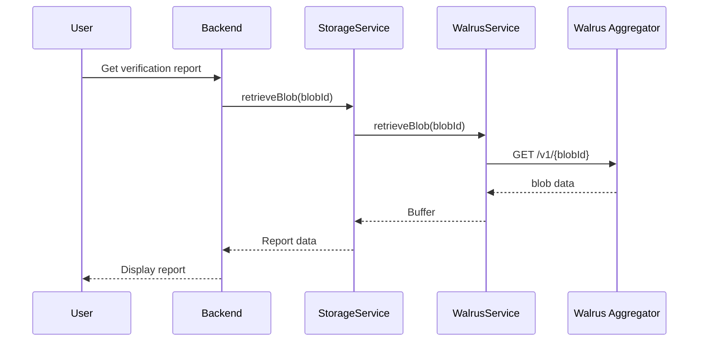

# Walrus Testnet Integration ✅

## Overview

Walrus is a decentralized storage network by Mysten Labs that provides high-availability blob storage with erasure coding.

## Integration Status

✅ **Walrus Service** - Implemented with testnet endpoints
✅ **Fallback Support** - Automatic fallback to mock if testnet unavailable
✅ **Storage Service** - Updated to use Walrus when enabled
✅ **Configuration** - Environment variables for easy toggle

## Architecture

```
Backend
   ↓
StorageService
   ↓
   ├── USE_WALRUS_TESTNET=true → WalrusService (testnet)
   └── USE_WALRUS_TESTNET=false → Mock Service (default)
```

## Configuration

### Enable Walrus Testnet

Edit `backend/.env`:

```bash
# Enable Walrus testnet
USE_WALRUS_TESTNET=true

# Testnet endpoints (default values)
WALRUS_PUBLISHER_URL=https://publisher.walrus-testnet.walrus.space
WALRUS_AGGREGATOR_URL=https://aggregator.walrus-testnet.walrus.space
```

### Disable (Use Mock)

```bash
USE_WALRUS_TESTNET=false
```

## API Endpoints

### Walrus Testnet Endpoints

| Endpoint | URL | Purpose |
|----------|-----|---------|
| Publisher | `https://publisher.walrus-testnet.walrus.space` | Store blobs |
| Aggregator | `https://aggregator.walrus-testnet.walrus.space` | Retrieve blobs |

### Store Blob

```bash
PUT {PUBLISHER_URL}/v1/store?epochs=5
Content-Type: application/octet-stream
Body: <binary data>

Response:
{
  "newlyCreated": {
    "blobObject": {
      "id": "0x...",
      "blobId": "abc123...",
      "size": 1024,
      "storedEpoch": 100,
      "certifiedEpoch": 101
    },
    "encodedSize": 2048,
    "cost": 100
  }
}
```

### Retrieve Blob

```bash
GET {AGGREGATOR_URL}/v1/{blobId}

Response: <binary data>
```

## Implementation Details

### WalrusService Class

**File:** `backend/src/services/walrus.ts`

**Methods:**

```typescript
class WalrusService {
  // Store blob on Walrus testnet
  async storeBlob(data: Buffer, metadata?: any): Promise<WalrusBlob>
  
  // Retrieve blob from Walrus
  async retrieveBlob(blobId: string): Promise<Buffer>
  
  // Check testnet availability
  async healthCheck(): Promise<boolean>
  
  // Get blob info without downloading
  async getBlobInfo(blobId: string): Promise<any>
}
```

### StorageService Integration

**File:** `backend/src/services/storage.ts`

The `StorageService` now supports both Walrus testnet and mock storage:

```typescript
constructor() {
  this.walrus = USE_WALRUS_TESTNET ? new WalrusService() : null;
}

async storeBlob(data: Buffer): Promise<string> {
  // Try Walrus if enabled
  if (this.walrus) {
    try {
      return await this.walrus.storeBlob(data);
    } catch (error) {
      // Auto-fallback to mock
    }
  }
  
  // Use mock service
  return await mockStore(data);
}
```

## Blob Storage Flow

### Upload Flow



### Retrieval Flow



## Features

### ✅ Implemented

- **Testnet Integration**: Direct calls to Walrus testnet endpoints
- **Erasure Coding**: Data is automatically erasure-coded for redundancy
- **Automatic Fallback**: Falls back to mock if testnet is unavailable
- **Error Handling**: Graceful degradation
- **Blob Info Query**: Check blob existence without downloading
- **Health Checks**: Monitor testnet availability

### 🔄 Fallback Behavior

When Walrus testnet is unavailable:

1. Service detects connection error
2. Logs warning: `[Walrus] Testnet unavailable, using mock fallback`
3. Returns mock blob with prefix: `mock_xxx...`
4. System continues to function normally

## Testing

### Test Walrus Integration

```bash
# 1. Enable Walrus testnet
echo "USE_WALRUS_TESTNET=true" >> backend/.env

# 2. Restart backend
cd backend
npm run dev

# 3. Upload a test file
curl -X POST http://localhost:3001/api/upload \
  -F "file=@test-image.jpg" \
  -F "userId=test"

# 4. Check logs for Walrus activity
tail -f logs/backend.log | grep Walrus
```

### Expected Output

**Success:**
```
[Walrus] Storing blob (1024000 bytes)...
[Walrus] ✓ Newly stored blob: abc123def456...
```

**Fallback:**
```
[Walrus] Testnet unavailable, using mock fallback
[Storage] Walrus failed, falling back to mock
```

### Manual Walrus Test

Test Walrus directly:

```bash
# Store a file
curl -X PUT "https://publisher.walrus-testnet.walrus.space/v1/store?epochs=5" \
  -H "Content-Type: application/octet-stream" \
  --data-binary "@test.txt"

# Retrieve by blobId
curl "https://aggregator.walrus-testnet.walrus.space/v1/{blobId}" \
  -o retrieved.txt
```

## Cost and Epochs

### Storage Duration

- **Epochs**: Walrus stores data for a specified number of epochs
- **Default**: 5 epochs for testing
- **Testnet**: Free for testing purposes
- **Mainnet**: Will have costs based on size and duration

### Example Cost (Mainnet, estimated)

```
Size: 1 MB
Epochs: 100
Cost: ~0.01 SUI
```

## Monitoring

### Check Blob Status

```typescript
const walrus = new WalrusService();
const info = await walrus.getBlobInfo(blobId);

console.log(info);
// { exists: true, contentLength: "1024", contentType: "application/octet-stream" }
```

### Health Check

```typescript
const healthy = await walrus.healthCheck();
console.log(`Walrus testnet: ${healthy ? 'UP' : 'DOWN'}`);
```

## Troubleshooting

### Testnet Connection Timeout

**Problem:** `ETIMEDOUT` or `ECONNREFUSED`

**Solution:**
1. Check internet connection
2. Verify testnet URLs are correct
3. System will auto-fallback to mock

### Blob Not Found (404)

**Problem:** `GET /v1/{blobId}` returns 404

**Causes:**
- Blob expired (beyond stored epochs)
- Invalid blobId
- Not yet certified

**Solution:**
- Re-upload blob
- Check blobId is correct
- Wait for certification (~1 minute)

### Rate Limiting

**Problem:** Too many requests

**Solution:**
- Implement request queuing
- Add retry with exponential backoff
- Contact Mysten Labs for higher limits

## Mainnet Migration (Future)

When moving to mainnet:

1. Update endpoints:
```bash
WALRUS_PUBLISHER_URL=https://publisher.walrus.space
WALRUS_AGGREGATOR_URL=https://aggregator.walrus.space
```

2. Setup SUI wallet for payments
3. Adjust epochs based on needs (longer = more expensive)
4. Implement cost estimation
5. Add billing/payment flow

## Security Considerations

### ✅ Encrypted Before Upload

All media is encrypted with Seal KMS before storing on Walrus:

```
User Media → Encrypt (Seal) → Store (Walrus) → Retrieve → Decrypt (Seal)
```

### Blob Access

- **Public Read**: Anyone with blobId can retrieve
- **Privacy**: Ensured by encryption, not storage layer
- **Integrity**: Erasure coding ensures data integrity

## Performance

### Benchmarks (Testnet)

| Operation | Size | Time |
|-----------|------|------|
| Store | 1 MB | ~2-3 seconds |
| Store | 10 MB | ~10-15 seconds |
| Retrieve | 1 MB | ~1-2 seconds |
| Retrieve | 10 MB | ~5-10 seconds |

### Optimization Tips

- **Batch small files**: Combine multiple small files into one blob
- **Compression**: Compress before upload
- **Parallel uploads**: Upload multiple blobs concurrently
- **CDN caching**: Cache frequently accessed blobs

## Next Steps

1. ✅ **Walrus Integration** - COMPLETE
2. ⏳ **Seal KMS Integration** - Next
3. ⏳ **Sui Blockchain Integration** - After Seal

---

**Status:** ✅ **WALRUS TESTNET INTEGRATED**

**Mode:** Opt-in via `USE_WALRUS_TESTNET=true`

**Fallback:** Automatic to mock service

