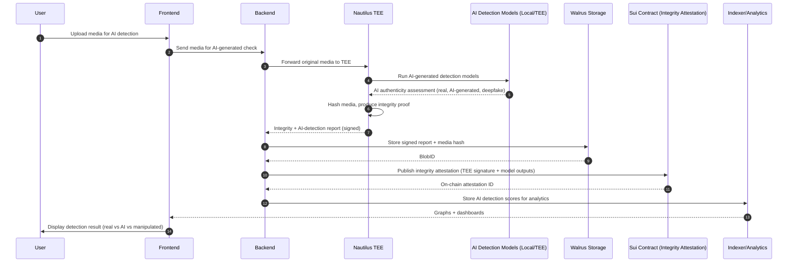

```mermaid
sequenceDiagram
    autonumber
    participant U as User
    participant FE as Frontend
    participant BK as Backend
    participant NT as Nautilus TEE
    participant MD as AI Detection Models (Local/TEE)
    participant WL as Walrus Storage
    participant SC as Sui Contract (Integrity Attestation)
    participant DB as Indexer/Analytics

    U->>FE: Upload media for AI detection
    FE->>BK: Send media for AI-generated check

    BK->>NT: Forward original media to TEE
    NT->>MD: Run AI-generated detection models
    MD-->>NT: AI authenticity assessment (real, AI-generated, deepfake)

    NT->>NT: Hash media, produce integrity proof
    NT-->>BK: Integrity + AI-detection report (signed)

    BK->>WL: Store signed report + media hash
    WL-->>BK: BlobID

    BK->>SC: Publish integrity attestation (TEE signature + model outputs)
    SC-->>BK: On-chain attestation ID

    BK->>DB: Store AI detection scores for analytics
    DB-->>FE: Graphs + dashboards
    FE->>U: Display detection result (real vs AI vs manipulated)
```