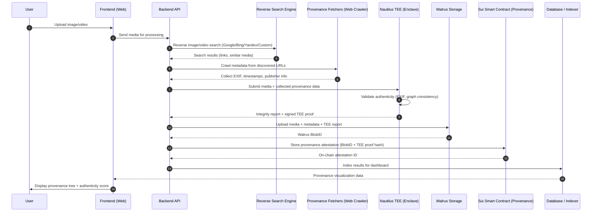

```mermaid
sequenceDiagram
    autonumber
    participant U as User
    participant FE as Frontend (Web)
    participant BK as Backend API
    participant RS as Reverse Search Engine
    participant PF as Provenance Fetchers (Web Crawler)
    participant NT as Nautilus TEE (Enclave)
    participant WL as Walrus Storage
    participant SC as Sui Smart Contract (Provenance)
    participant DB as Database / Indexer

    U->>FE: Upload image/video
    FE->>BK: Send media for processing
    BK->>RS: Reverse image/video search (Google/Bing/Yandex/Custom)
    RS-->>BK: Search results (links, similar media)
    BK->>PF: Crawl metadata from discovered URLs
    PF-->>BK: Collect EXIF, timestamps, publisher info

    BK->>NT: Submit media + collected provenance data
    NT->>NT: Validate authenticity (EXIF, graph consistency)
    NT-->>BK: Integrity report + signed TEE proof

    BK->>WL: Upload media + metadata + TEE report
    WL-->>BK: Walrus BlobID

    BK->>SC: Store provenance attestation (BlobID + TEE proof hash)
    SC-->>BK: On-chain attestation ID

    BK->>DB: Index results for dashboard
    DB-->>FE: Provenance visualization data
    FE->>U: Display provenance tree + authenticity score
```