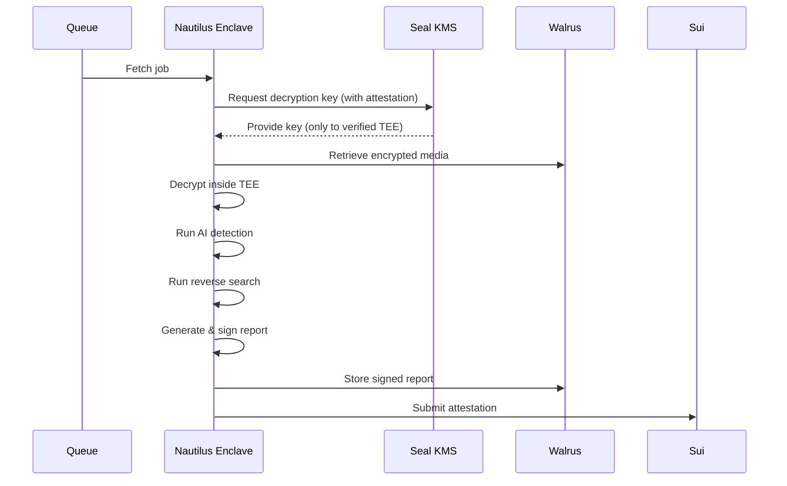

# Nautilus TEE (Trusted Execution Environment)

## Overview

Nautilus is Mysten Labs' TEE infrastructure for secure, verifiable off-chain computation. It enables AI models and oracles to process sensitive data within hardware-protected enclaves.

## Current Implementation

### Mock Enclave Service

**File:** `services/mock-services/src/services/nautilus.ts`

The current implementation provides a **mock Nautilus enclave** for development and testing:

```typescript
class NautilusService {
  // Generate signed attestation (mock)
  async generateAttestation(reportData: VerificationReport): Promise<string>
  
  // Verify enclave attestation (mock)
  async verifyAttestation(signature: string, data: any): Promise<boolean>
}
```

### Integration Points

1. **Orchestrator Service** calls Nautilus to sign verification reports:
```typescript
// backend/src/services/orchestrator.ts
const enclaveSignature = await nautilus.generateAttestation(report);
```

2. **Enclave ID** is configured via environment:
```bash
ENCLAVE_ID=mock_enclave_1
```

## Architecture (Production)

```
┌─────────────────────────────────────────┐
│         Nautilus Enclave Node           │
├─────────────────────────────────────────┤
│  • SGX/TDX Hardware Protection          │
│  • Seal KMS Integration                 │
│  • AI Detection Models (Inside TEE)     │
│  • Report Signing (Attested)            │
└─────────────────────────────────────────┘
         ↓
    Signed Report
         ↓
    Sui Blockchain
```

## Flow with Nautilus

### 1. Job Processing in Enclave



### 2. Attestation Structure

```typescript
interface EnclaveAttestation {
  enclaveId: string;           // Enclave identifier
  mrenclave: string;           // Enclave measurement (SGX)
  mrsigner: string;            // Signer identity
  reportData: string;          // Hash of verification report
  signature: string;           // TEE signature
  timestamp: number;
  teeType: "SGX" | "TDX";     // Hardware type
}
```

## Why Nautilus?

### Security Guarantees

1. **Confidentiality**: Data decrypted only inside TEE
2. **Integrity**: Code execution is verifiable
3. **Attestation**: Cryptographic proof of environment
4. **Isolation**: Protected from OS/hypervisor

### Use Cases in Our System

1. **Secure AI Processing**: Models run in protected memory
2. **Key Management**: Seal KMS only releases keys to verified enclaves
3. **Report Signing**: Attestations prove computations happened in TEE
4. **Multi-Party Verification**: Multiple enclaves can independently verify

## Production Setup (Future)

### Prerequisites

- SGX-capable hardware (Intel) or TDX (Intel/AMD)
- Nautilus node software from Mysten Labs
- Sealed AI models for enclave deployment

### Configuration

```bash
# Nautilus Configuration
NAUTILUS_ENCLAVE_ID=prod_enclave_xxx
NAUTILUS_ATTESTATION_URL=https://nautilus.mysten.io
NAUTILUS_MRENCLAVE=0xabc123...
NAUTILUS_MRSIGNER=0xdef456...

# Seal KMS Integration
SEAL_API_URL=https://seal.mysten.io
SEAL_API_KEY=enclave_key_xxx

# TEE Hardware
TEE_TYPE=SGX  # or TDX
```

### Deployment Steps

1. **Build Enclave Package**:
```bash
# Package AI models and code for TEE
nautilus build --models ai-detection/ --config enclave.toml
```

2. **Measure Enclave**:
```bash
# Generate MRENCLAVE value
nautilus measure enclave.signed
```

3. **Deploy to Nautilus Node**:
```bash
# Deploy to production enclave
nautilus deploy --node https://nautilus-node.mysten.io
```

4. **Register with Seal**:
```bash
# Register enclave with Seal KMS
seal register-enclave --mrenclave 0xabc... --policy media-verification
```

## Current vs Production

| Feature | Current (Mock) | Production (Nautilus) |
|---------|---------------|----------------------|
| Encryption | AES-256-GCM | Hardware-protected |
| Key Access | Simulated | Seal KMS attestation |
| AI Models | Host memory | Enclave memory |
| Signatures | Random hash | TEE signature |
| Attestation | Mock | Cryptographic proof |
| Verifiability | Trust-based | Hardware-verified |

## Mock Implementation Details

### Current Mock Service

```typescript
// services/mock-services/src/services/nautilus.ts
async generateAttestation(reportData: VerificationReport): Promise<string> {
  // Mock: Generate random signature
  const signature = crypto.createHash('sha256')
    .update(JSON.stringify(reportData))
    .update(process.env.ENCLAVE_ID || 'mock_enclave_1')
    .digest('hex');
  
  return signature;
}
```

This is **sufficient for development** but **NOT production-ready**.

## Testing Nautilus Integration

### With Mock Service

```bash
# Current setup works out-of-the-box
./start-all-services.sh
python test_e2e_flow.py
```

### Output:
```
✓ Enclave signature: abc123...  (mock)
✓ Attestation stored on Sui
```

## Migration to Real Nautilus

When ready for production:

1. **Deploy Nautilus Nodes**: Set up SGX/TDX hardware
2. **Package Models**: Build enclave-compatible binaries
3. **Register Enclaves**: Add to Seal KMS policy
4. **Update Backend**: Point to real Nautilus endpoints
5. **Verify Attestations**: Implement attestation verification

## Documentation References

For production Nautilus:
- GitHub: https://github.com/MystenLabs/nautilus
- Docs: https://docs.sui.io (Nautilus section)

## Related Services

- **Seal KMS**: Provides keys only to attested enclaves
- **Walrus**: Stores encrypted data retrieved by enclaves
- **Sui**: Records enclave attestations on-chain

## Security Model

```
┌──────────────────────────────────────────┐
│         Nautilus TEE Enclave             │
│  ┌────────────────────────────────────┐  │
│  │  • Encrypted Media                 │  │
│  │  • AI Models                       │  │
│  │  • Decryption Keys (from Seal)     │  │
│  │  • Verification Logic              │  │
│  └────────────────────────────────────┘  │
│                                          │
│  Hardware Protected Memory               │
│  - Encrypted at rest                     │
│  - Isolated from OS                      │
│  - Attestation required                  │
└──────────────────────────────────────────┘
```

## Summary

✅ **Current**: Mock Nautilus for development
⏳ **Production**: Real TEE when deploying to production
📚 **Docs**: Flow diagrams show Nautilus integration
🔐 **Security**: Hardware-backed attestation for mainnet

Nautilus is **designed into the architecture** but currently using **mock implementation** for development phase.

