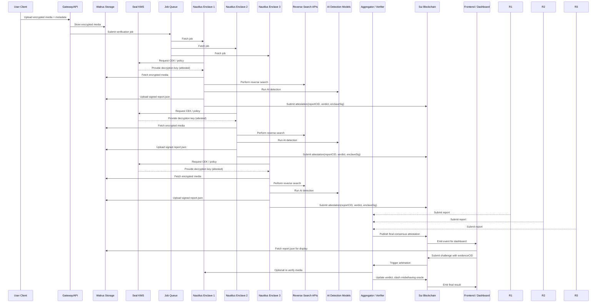

```mermaid
sequenceDiagram
  participant U as User Client
  participant GW as Gateway/API
  participant W as Walrus Storage
  participant S as Seal KMS
  participant Q as Job Queue
  participant E1 as Nautilus Enclave 1
  participant E2 as Nautilus Enclave 2
  participant E3 as Nautilus Enclave 3
  participant RS as Reverse Search APIs
  participant M as AI Detection Models
  participant Ag as Aggregator / Verifier
  participant Sui as Sui Blockchain
  participant UI as Frontend / Dashboard

  U->>GW: Upload encrypted media + metadata
  GW->>W: Store encrypted media
  GW->>Q: Submit verification job

  Q->>E1: Fetch job
  Q->>E2: Fetch job
  Q->>E3: Fetch job

  E1->>S: Request CEK / policy
  S-->>E1: Provide decryption key (attested)
  E1->>W: Fetch encrypted media
  E1->>RS: Perform reverse search
  E1->>M: Run AI detection
  E1->>W: Upload signed report.json
  E1->>Sui: Submit attestation(reportCID, verdict, enclaveSig)

  E2->>S: Request CEK / policy
  S-->>E2: Provide decryption key (attested)
  E2->>W: Fetch encrypted media
  E2->>RS: Perform reverse search
  E2->>M: Run AI detection
  E2->>W: Upload signed report.json
  E2->>Sui: Submit attestation(reportCID, verdict, enclaveSig)

  E3->>S: Request CEK / policy
  S-->>E3: Provide decryption key (attested)
  E3->>W: Fetch encrypted media
  E3->>RS: Perform reverse search
  E3->>M: Run AI detection
  E3->>W: Upload signed report.json
  E3->>Sui: Submit attestation(reportCID, verdict, enclaveSig)

  R1-->>Ag: Submit report
  R2-->>Ag: Submit report
  R3-->>Ag: Submit report

  Ag->>Sui: Publish final consensus attestation
  Sui->>UI: Emit event for dashboard
  UI->>W: Fetch report.json for display

  %% Optional challenge/dispute flow
  UI->>Sui: Submit challenge with evidenceCID
  Sui->>Ag: Trigger arbitration
  Ag->>E1: Optional re-verify media
  Ag->>Sui: Update verdict, slash misbehaving oracle
  Sui->>UI: Emit final result
```
