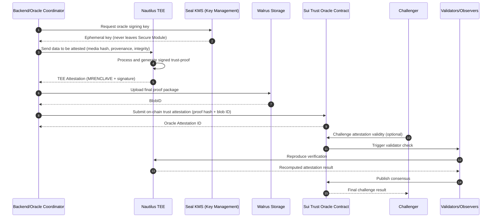

```mermaid
sequenceDiagram
    autonumber
    participant BK as Backend/Oracle Coordinator
    participant NT as Nautilus TEE
    participant SL as Seal KMS (Key Management)
    participant WL as Walrus Storage
    participant SC as Sui Trust Oracle Contract
    participant CH as Challenger
    participant V as Validators/Observers

    BK->>SL: Request oracle signing key
    SL-->>BK: Ephemeral key (never leaves Secure Module)

    BK->>NT: Send data to be attested (media hash, provenance, integrity)
    NT->>NT: Process and generate signed trust-proof
    NT-->>BK: TEE Attestation (MRENCLAVE + signature)

    BK->>WL: Upload final proof package
    WL-->>BK: BlobID

    BK->>SC: Submit on-chain trust attestation (proof hash + blob ID)
    SC-->>BK: Oracle Attestation ID

    CH->>SC: Challenge attestation validity (optional)
    SC->>V: Trigger validator check
    V->>NT: Reproduce verification
    NT-->>V: Recomputed attestation result
    V->>SC: Publish consensus
    SC-->>CH: Final challenge result
```